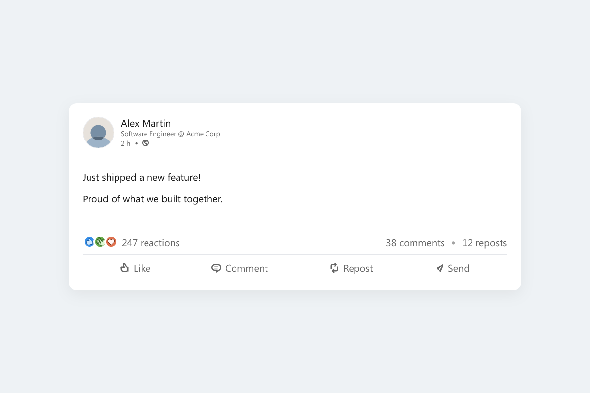
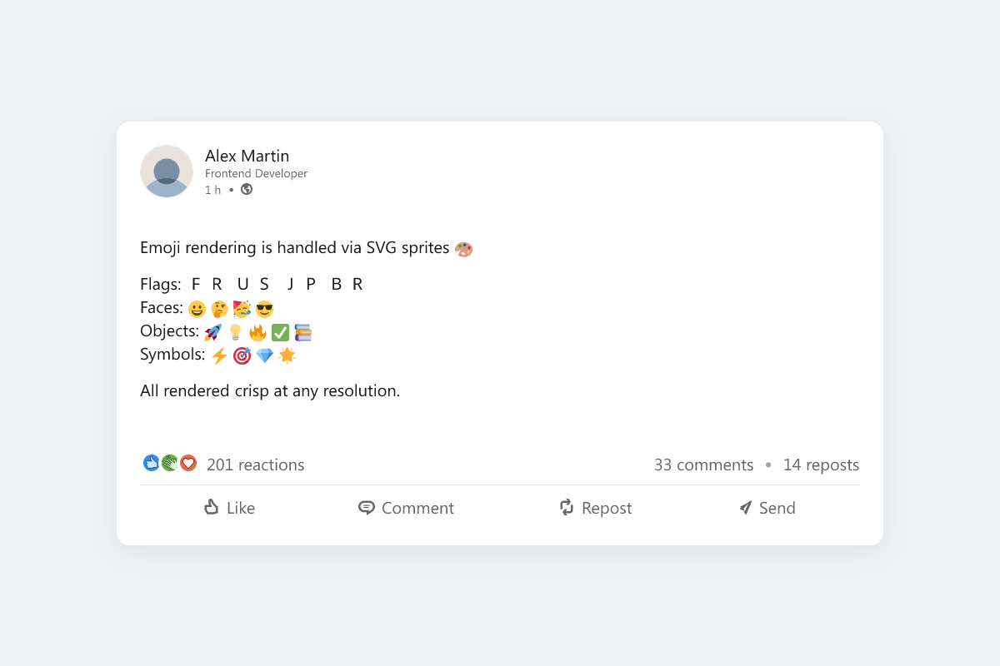
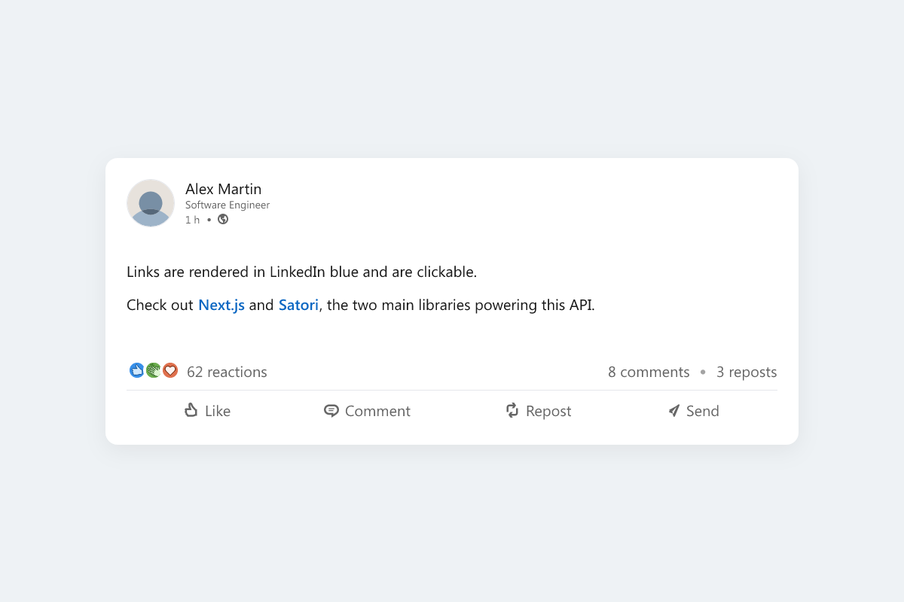
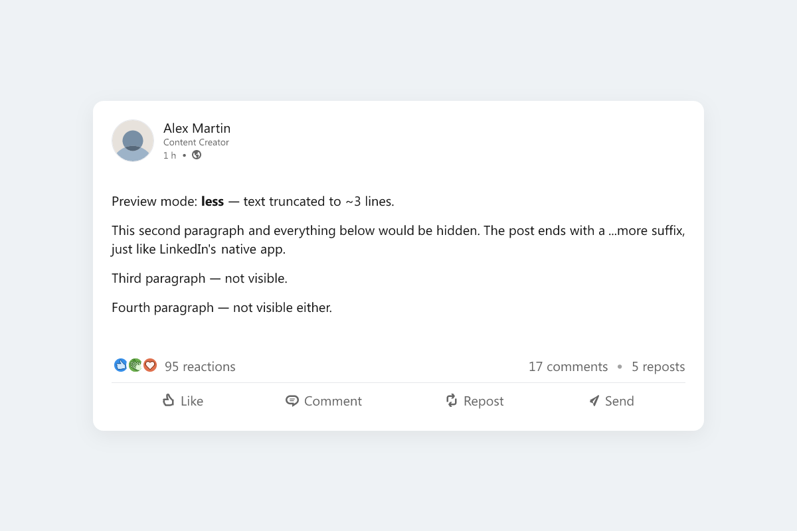
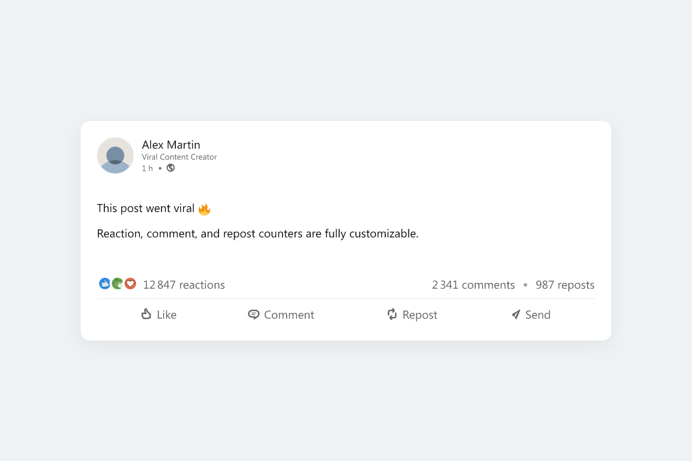
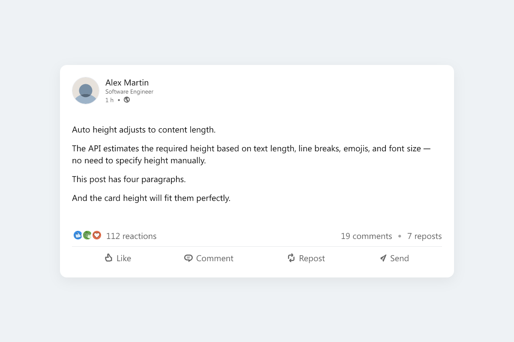

# LinkedIn Post Image Generator

A self-hosted **Next.js API** that generates pixel-perfect **LinkedIn post PNG images** from a JSON payload. Send a POST request, get a PNG back.



## What it does

The API renders a complete LinkedIn post — profile header, formatted body text, reaction counters, action bar — and returns a high-resolution PNG image. It supports:

- Lightweight **markdown** (bold, italic, links, hashtags)
- **Emoji** rendering via SVG sprites (Twemoji / Noto Color Emoji)
- Platform-native **typography** (Windows → Segoe UI, macOS/iOS → SF Pro, Android → Roboto)
- Responsive **device layouts** (mobile 800px / tablet 1000px / desktop 1200px)
- LinkedIn-style **image gallery** (1–4+ attachments with overflow badge)
- Fully customizable **color themes**
- **Auto-height** calculation based on content length
- **Preview modes**: full post (`more`) or truncated with "…more" suffix (`less`)
- Three **profile picture** input methods: remote URL, inline SVG, or public file path

## Tech stack

| Tool | Role |
|---|---|
| [Next.js 15](https://nextjs.org/) | API framework (Node.js runtime) |
| [Satori](https://github.com/vercel/satori) | React component tree → SVG |
| [@resvg/resvg-js](https://github.com/yisibl/resvg-js) | SVG → PNG |
| TypeScript | Type safety |
| Bundled fonts | Inter, SF Pro Text, Segoe UI, Roboto, Noto Emoji |

## Quick start

### Requirements

- Node.js 18+
- npm

### Install and run

```bash
git clone https://github.com/your-username/linkedin-post-generator.git
cd linkedin-post-generator
npm install
npm run dev
```

The API is available at `http://localhost:3000/api/linkedin-image`.

### Health check

```bash
curl http://localhost:3000/api/linkedin-image
# {"ok":true,"message":"POST an object to get a PNG back."}
```

### Generate your first image

```bash
curl -sS -X POST http://localhost:3000/api/linkedin-image \
  -H "Content-Type: application/json" \
  -d '{
    "firstName": "Alex",
    "lastName": "Martin",
    "headline": "Software Engineer @ Acme Corp",
    "textMarkdown": "Excited to share my **new open-source project** 🚀\n\nBuilt with #NextJS and #TypeScript.\n\n[Check it out on GitHub](https://github.com)",
    "reactions": 247,
    "comments": 38,
    "reposts": 12
  }' \
  --output my-post.png
```

## API reference

### `POST /api/linkedin-image`

Returns a PNG image (binary, `Content-Type: image/png`).

#### Required fields

| Field | Type | Description |
|---|---|---|
| `firstName` | `string` | Author first name |
| `lastName` | `string` | Author last name |
| `textMarkdown` | `string` | Post body. Supports `**bold**`, `*italic*`, `[text](url)`, `#hashtag`, `\n` line breaks |

#### Profile picture (pick one, or omit for default avatar)

| Field | Type | Description |
|---|---|---|
| `profileImageUrl` | `string` | Remote image URL — fetched and embedded as base64 |
| `profileSvgMarkup` | `string` | Raw SVG XML string |
| `profileSvgPublicPath` | `string` | Path to a file inside `/public` (e.g. `"icons/avatar-default.svg"`) |

#### Content & metadata

| Field | Type | Default | Description |
|---|---|---|---|
| `headline` | `string` | `""` | Job title shown under the name |
| `timeAgo` | `string` | `"• 1 h"` | Time label (e.g. `"2 h"`, `"3 d"`) |
| `reactions` | `number` | `0` | Reaction count |
| `comments` | `number` | `0` | Comment count |
| `reposts` | `number` | `0` | Repost count |

#### Layout

| Field | Type | Default | Description |
|---|---|---|---|
| `platformStyle` | `"windows" \| "mac" \| "ios" \| "android"` | `"windows"` | Font stack |
| `devicePreview` | `"mobile" \| "tablet" \| "desktop"` | `"desktop"` | Width preset (800 / 1000 / 1200 px) |
| `typePreview` | `"more" \| "less"` | `"more"` | `"less"` truncates text to ~3 visible lines |
| `size.width` | `number` | device-dependent | Custom width in px (600–2000) |
| `size.height` | `number \| "auto"` | `"auto"` | Custom height in px (800–4000) or `"auto"` |

#### Theme

All fields are optional CSS color strings (hex, `rgba()`, etc.).

| Field | Default | Description |
|---|---|---|
| `theme.background` | `"#EEF2F5"` | Page background |
| `theme.card` | `"#FFFFFF"` | Post card background |
| `theme.text` | `"#000000e6"` | Primary text |
| `theme.subtext` | `"#00000099"` | Secondary text (headline, time, counters) |
| `theme.divider` | `"#E5E7EB"` | Divider line above the action bar |

#### Image attachments

| Field | Type | Description |
|---|---|---|
| `attachmentsUrls` | `string[]` | Remote image URLs — fetched and embedded |
| `attachmentsData` | `string[]` | Already-encoded base64 data URLs |

Attachment grid layouts:

| Count | Layout |
|---|---|
| 1 | Full width |
| 2 | 50 / 50 side-by-side |
| 3 | 1 large left + 2 stacked right |
| 4+ | 2×2 grid — excess shown as `+N` badge |

#### Response

| Status | Body | Meaning |
|---|---|---|
| `200` | `image/png` binary | Success |
| `400` | `{ "error": string }` | Missing or invalid fields |
| `500` | `{ "error": string, "detail": string }` | Server-side error |

## More examples

### Dark custom theme

```bash
curl -sS -X POST http://localhost:3000/api/linkedin-image \
  -H "Content-Type: application/json" \
  -d '{
    "firstName": "Alex",
    "lastName": "Martin",
    "textMarkdown": "Dark mode LinkedIn post 🌙",
    "theme": {
      "background": "#1A1A2E",
      "card": "#16213E",
      "text": "#E0E0E0",
      "subtext": "#9E9E9E",
      "divider": "#2A2A4A"
    }
  }' \
  --output dark-theme.png
```

### Mobile layout with truncated text

```bash
curl -sS -X POST http://localhost:3000/api/linkedin-image \
  -H "Content-Type: application/json" \
  -d '{
    "firstName": "Alex",
    "lastName": "Martin",
    "textMarkdown": "A very long post that gets cut off in the preview...\n\nThis part will not be visible.\n\nNeither will this.",
    "devicePreview": "mobile",
    "typePreview": "less"
  }' \
  --output mobile-truncated.png
```

### 4-image gallery

```bash
curl -sS -X POST http://localhost:3000/api/linkedin-image \
  -H "Content-Type: application/json" \
  -d '{
    "firstName": "Alex",
    "lastName": "Martin",
    "textMarkdown": "Four screenshots from the project 👇",
    "size": { "height": "auto" },
    "attachmentsUrls": [
      "https://picsum.photos/seed/a/800/600",
      "https://picsum.photos/seed/b/800/600",
      "https://picsum.photos/seed/c/800/600",
      "https://picsum.photos/seed/d/800/600"
    ]
  }' \
  --output gallery.png
```

See the [`examples/`](examples/) folder for ready-to-use JSON payloads covering every major feature.

## Test image generation

The repo ships with a script that calls the API once per feature and writes labelled PNGs into `test-img/`. Start the dev server first, then run:

```bash
npm run dev &        # start the API
npm run test:images  # generate ~25 images in test-img/
```

Each output file is named after what it demonstrates:

```
test-img/
  basic-post.png
  markdown-bold-italic.png
  markdown-links.png
  markdown-hashtags.png
  markdown-combined.png
  emoji-rendering.png
  line-breaks.png
  platform-windows.png
  platform-mac.png
  platform-android.png
  device-mobile.png
  device-tablet.png
  device-desktop.png
  preview-more.png
  preview-less.png
  auto-height.png
  reactions-counts.png
  custom-theme-dark.png
  avatar-remote-url.png
  avatar-inline-svg.png
  avatar-default.png
  attachments-1-image.png
  attachments-2-images.png
  attachments-3-images.png
  attachments-4-plus-images.png
```

The `API_URL` environment variable overrides the default `http://localhost:3000`:

```bash
API_URL=https://my-deployment.example.com npm run test:images
```

## Sample outputs

| Feature | Preview |
|---|---|
| Basic post |  |
| Emoji rendering |  |
| Markdown (links, hashtags) |  |
| Preview mode: less |  |
| Reactions & action bar |  |
| Auto height |  |

## Project structure

```
src/
  app/api/linkedin-image/
    route.ts          ← API handler, validation, orchestration
  lib/og/
    post.ts           ← LinkedIn post React component (Satori input)
    markdown.ts       ← Markdown parser and emoji handling
    theme.ts          ← Color palette utilities
    fonts.ts          ← Font loading from /public/fonts/
    fontStacks.ts     ← Platform-specific font fallback chains
    icons.ts          ← SVG icon definitions
    reactions.ts      ← Reaction badge renderer
    actions.ts        ← Action bar (Like / Comment / Repost / Send)
public/
  fonts/              ← Bundled Inter, SF Pro Text, Segoe UI, Roboto, Noto Emoji
  icons/              ← Default avatar and reaction SVGs
  emoji/              ← Twemoji and Noto Color Emoji SVG sprites
examples/             ← Ready-to-use JSON payloads
scripts/
  generate-test-images.sh   ← Test image generation script
test-img/             ← Sample PNG outputs (generated by the script above)
```

## License

MIT — see [LICENSE](LICENSE).
